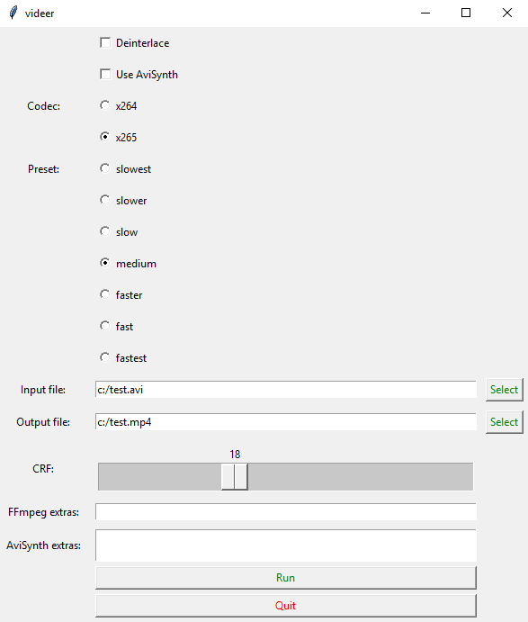

# videer
FFmpeg GUI with avisynth support for deinterlacing and profile configuration that can be used in frameserving ([link](https://github.com/satishsampath/frame-server)).

Requirements:
- [FFmpeg](https://ffmpeg.org/) (in system path)
- For avisynth, you will need [avisynth](http://avisynth.nl/index.php/Main_Page) installed
- For deinterlacing, you will need to have [QTGMC](http://forum.doom9.org/attachment.php?attachmentid=16264&d=1521180781) installed and all the required plugins:
    - [MaskTools2](https://github.com/pinterf/masktools/releases/download/2.2.18/masktools2-v2.2.18.7z)
    - [MVTools2](https://github.com/pinterf/mvtools/releases/download/2.7.41/mvtools-2.7.41-with-depans.7z)
    - [nnedi3](https://github.com/jpsdr/NNEDI3/releases/download/0.9.4.53/NNEDI3_v0_9_4_53.7z)
    - [RgTools](https://github.com/pinterf/RgTools/releases/download/0.98/RgTools-0.98.7z)
    - [SMDegrain](https://pastebin.com/u1xsPLwK) (smdegrain.avsi)
    
    
    
