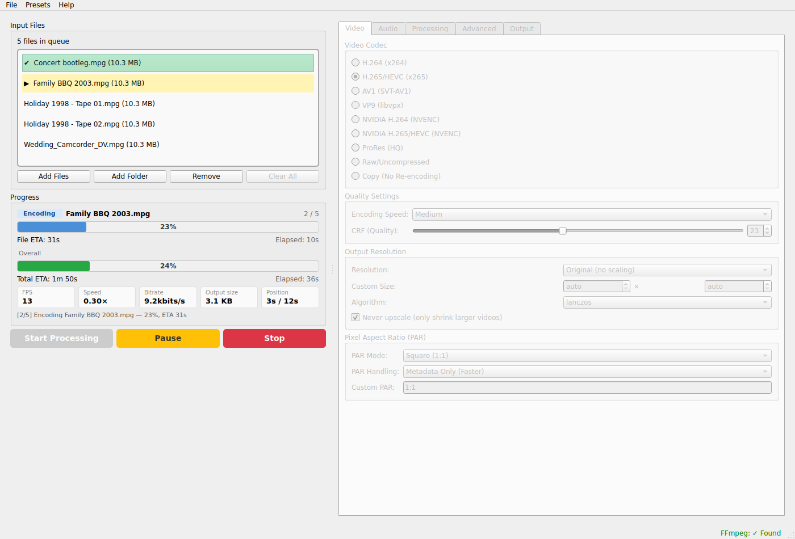

# videer

FFmpeg batch GUI with AviSynth support for **deinterlacing** and profile configuration that can be used in [*
*frameserving**](https://github.com/satishsampath/frame-server). Created as a replacement for inflexible batch files
that do not allow multiple encodings at the same time easily.
Videer integrates `QTGMC`, which provides much smoother results than
ffmpeg's `yadif`, [see for yourself](https://www.youtube.com/watch?v=jE47A57T5FA). `QTGMC` is the best deinterlacer in
existence. Including AI and DaVinci Studio.

## Notice

If you are not using a frameserver and are just trying to transcode video with any feature that requires Avisynth+, and are running into issues, you should try with ffms2 enabled.

## Why

FFmpeg is a superior command line video encoding tool. Videer serves as a GUI for it.

## New features:

- Multithreading using `SetFilterMTMode`
- AviSynth+
- 64bit Implementation
- Matroska format as it is the only one to support `pgssub`
- CUDA GPU acceleration support
- Live queue: add files or drag-drop while encoding is running — new files are appended and processed without restarting
- Optional resolution scaling (2160p → 360p presets or custom W×H, "never upscale" guard, selectable lanczos/bicubic/spline/bilinear/neighbor scaler)
- Deinterlacer choice: `QTGMC` (AviSynth+, Windows) or FFmpeg's `bwdif` / `yadif` (any OS, any input)
- AV1 (SVT-AV1) and VP9 encoders with per-encoder speed presets; NVENC uses the modern `p1`–`p7` presets
- Live progress panel: per-file and total ETA, fps, speed, bitrate, output size, position — parsed from FFmpeg's machine-readable `-progress` output
- Settings sanity check before starting (container/codec mismatches, ignored options, missing AviSynth plugins)
- Cross-platform: runs on Windows, Linux and macOS (AviSynth+/QTGMC features are Windows-only); no shell or PowerShell calls

## Requirements:

- [FFmpeg](https://ffmpeg.org/) in the system PATH or next to videer (a Windows build is attached to the [latest release](https://github.com/hclivess/videer/releases/latest) as `ffmpeg.7z`)
- For QTGMC deinterlacing / AviSynth+ processing (Windows): [AviSynth+](https://avs-plus.net/) — the tested MT installer is attached to the [latest release](https://github.com/hclivess/videer/releases/latest) as `AviSynthPlus-MT-r2772.exe`
- No need to install AviSynth plugins, all are bundled in `plugins/`
- Python 3.9+ — on Windows run `run.cmd` (installs `requirements.txt` via pip and starts the app), or manually `pip install -r requirements.txt && python main.py`

### Preview:

