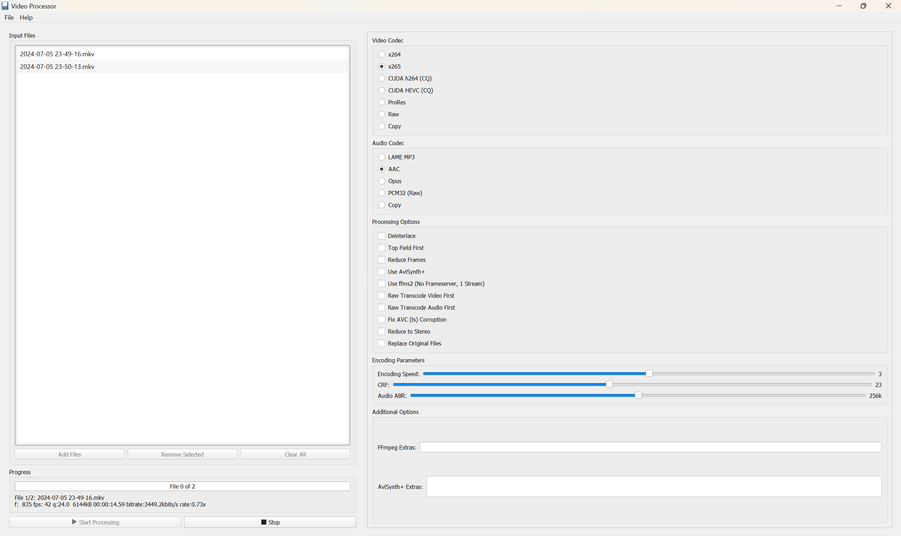

# videer
FFmpeg GUI with AviSynth support for deinterlacing and profile configuration that can be used in frameserving ([link](https://github.com/satishsampath/frame-server)). Created as a replacement for inflexible batch files that do not allow multiple encodings at the same time easily and make configuration complicated.

--

## New features:
- Multithreading using `SetFilterMTMode`
- AviSynth+
- 64bit Implementation

## Requirements:
- [FFmpeg](https://ffmpeg.org/) (in system path)
- For AviSynth, you will need [AviSynth+](https://avs-plus.net/) installed
- For deinterlacing, you will need to have AviSynth with [QTGMC](http://forum.doom9.org/attachment.php?attachmentid=16264&d=1521180781) installed and all the required plugins:
    - [MaskTools2](https://github.com/pinterf/masktools/releases/download/2.2.18/masktools2-v2.2.18.7z)
    - [MVTools2](https://github.com/pinterf/mvtools/releases/download/2.7.41/mvtools-2.7.41-with-depans.7z)
    - [nnedi3](https://github.com/jpsdr/NNEDI3/releases/download/0.9.4.53/NNEDI3_v0_9_4_53.7z)
    - [RgTools](https://github.com/pinterf/RgTools/releases/download/0.98/RgTools-0.98.7z)
    - [SMDegrain](https://pastebin.com/u1xsPLwK) (smdegrain.avsi)

### Build requirements:
- Python 3 with tkinter, no additional requirements
- My favorite way to build is using Nuitka:
```
python -m nuitka videer.py
```

### Preview:    

